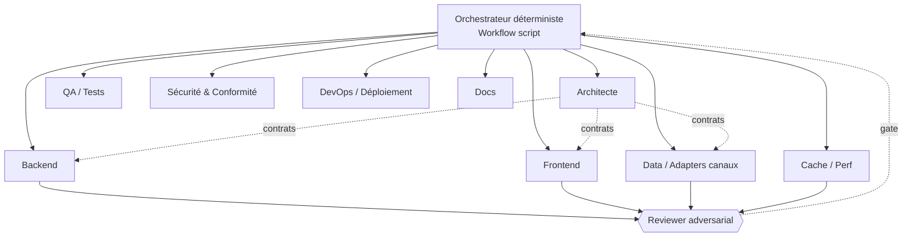
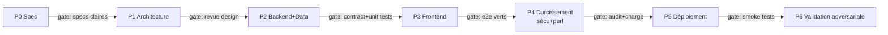

# Architecture multi-agents — Webapp « hotel-deal-finder »

> Document de référence pour **développer et valider** la webapp par une équipe
> d'agents spécialisés orchestrés. Usage cible : **perso / interne**. Objectif :
> couvrir **tous les aspects techniques et fonctionnels** selon les best practices,
> en réutilisant les modules Node déjà écrits et testés.

## 0. Principes directeurs (best practices)

1. **Un agent = une spécialité, un contrat clair** (entrées/sorties typées). Pas
   d'agent « fourre-tout ».
2. **Orchestration déterministe** : un orchestrateur (script, pas un LLM) pilote
   le flux, les phases et les barrières ; les agents sont des workers *stateless*.
3. **Portes de validation (quality gates)** : aucune phase ne passe sans une
   vérification **adversariale** indépendante (un autre agent tente de la casser).
4. **Source unique de vérité** : contrats partagés (OpenAPI, types, fixtures de
   test) versionnés — les agents s'y réfèrent, ne les redéfinissent pas.
5. **Honnêteté du produit** (héritée de l'agent) : `verified` / `signal` /
   `no_price` jamais confondus ; aucune donnée inventée.
6. **Human-in-the-loop** aux jalons majeurs (design validé, avant déploiement).
7. **Reproductibilité & observabilité** : tout run est journalisé, rejouable,
   les tests tournent sans réseau (fixtures).

## 1. Topologie des agents

### Rôles et responsabilités

| Agent | Responsabilité | Livrables | Contrat de sortie |
|---|---|---|---|
| **Orchestrateur** | Flux, phases, barrières, budget | run journalisé | statut par phase |
| **Architecte** | Design système, API, modèle de données, ADR | OpenAPI, schémas, ADRs | contrats figés |
| **Backend** | API Express wrappant les modules `.mjs` | routes `/api/*`, validation d'entrée | conforme OpenAPI |
| **Frontend** | UI recherche → classement (FR, EUR/TND) | SPA/HTML+JS | conforme maquette + a11y |
| **Data / Adapters** | Adaptateurs canaux (TunisieBooking…), détection de dérive | modules + fixtures | schéma d'offre normalisé |
| **Cache / Perf** | Cache TTL, anti-throttling, pacing | couche cache, budgets perf | pas de dépassement rate-limit |
| **QA / Tests** | Unit + intégration + e2e | suites de tests, couverture | tous verts, seuils tenus |
| **Sécurité & Conformité** | Secrets, validation, deps, CGU | audit, checklist | 0 secret, 0 vuln critique |
| **DevOps** | CI/CD, env, monitoring, déploiement | pipeline, scripts run/deploy | build + smoke OK |
| **Docs** | README, doc API, runbooks | docs à jour | complétude |
| **Reviewer(s) adversarial** | Casser chaque livrable (bugs, sécurité, altitude) | findings vérifiés | gate go/no-go |

## 2. Cycle de développement (phases + portes)

**Definition of Done par phase** (extrait) :
- **P1** : OpenAPI complet, modèle de données, ADRs sur les 3 décisions clés
  (cache, canaux, périmètre prix) ; revue design passée.
- **P2** : chaque route couverte par un contract test + unit tests sur fixtures
  (réutilise le pattern *drift canary* existant) ; 0 appel réseau en test.
- **P3** : parcours e2e (Playwright) recherche→classement vert ; a11y de base.
- **P4** : audit sécurité (0 secret, deps clean), test de charge/rate-limit tenu.
- **P5** : déployé (local/Render/Fly), smoke tests verts, runbook écrit.
- **P6** : panel adversarial (≥3 sceptiques) ne trouve aucun défaut bloquant.

## 3. Matrice de couverture (tous aspects)

### Technique
| Aspect | Couvert par | Best practice appliquée |
|---|---|---|
| Design API | Architecte | OpenAPI-first, versionné |
| Validation d'entrée | Backend + Sécu | schéma (zod), rejets explicites |
| Cache & rate-limit | Cache/Perf | TTL par (hôtel,dates), pacing, backoff |
| Gestion d'erreurs | Backend | statuts honnêtes, pas d'exception muette |
| Tests | QA | pyramide unit>intégration>e2e, fixtures |
| Sécurité | Sécu | secrets en env, deps audit, headers |
| Observabilité | DevOps | logs structurés, métriques, traces |
| CI/CD | DevOps | lint+test+build sur push, gate merge |
| Déploiement | DevOps | reproductible, config par env |
| Détection de dérive | Data | canary (rooms sans prix → `drift`) |

### Fonctionnel
| Fonction | Statut actuel | À faire webapp |
|---|---|---|
| Recherche hôtel/ville | ✅ modules | formulaire + endpoint |
| Occupation (adultes + âges enfants) | ✅ | UI occupants |
| Dates flexibles (fenêtre) | ✅ | sélecteur + balayage |
| Tarification multi-canal | ✅ Tunisie / signal monde | affichage par tier |
| Classement par prix | ✅ | tableau triable |
| Devise EUR/TND (FX live) | ✅ | toggle |
| Routage par pays | ✅ | auto (geo) |
| Statut honnête (verified/signal) | ✅ | badges UI |
| i18n FR | partiel | libellés FR |

## 4. Mécanique d'orchestration (mapping outillage réel)

- **Orchestrateur** = script **Workflow** (flux déterministe : `phase()`,
  `pipeline()`, `parallel()`, barrières). Chaque composant est un `agent()`.
- **Agents** = sous-agents (Agent tool) avec des **définitions réutilisables**
  dans `.claude/agents/` (system prompt + outils par rôle).
- **Validation** = pattern *adversarial verify* : pour chaque livrable, N
  sceptiques indépendants tentent de le réfuter ; majorité requise pour passer.
- **Contrats** = fichiers versionnés (`openapi.yaml`, `schemas/`, fixtures) que
  tous les agents consomment.

## 5. Stratégie de validation (« valider la solution »)

1. **Contract tests** : chaque route vs OpenAPI (dredd/schemathesis-like).
2. **Unit** : fonctions pures sur fixtures (déjà 27 tests ; on étend).
3. **Intégration** : API + cache, canaux mockés par fixtures HTML sauvegardées.
4. **E2E** : Playwright pilote l'UI, parcours réels.
5. **Adversarial** : panel de reviewers cherche bugs/sécurité/altitude.
6. **Charge / rate-limit** : vérifie que le cache tient sous rafale (le bug de
   throttling qu'on a corrigé ne doit pas réapparaître).

## 6. Risques & mitigations

| Risque | Mitigation |
|---|---|
| Throttling TunisieBooking | Cache TTL + pacing + concurrence plafonnée |
| Dérive HTML du site | Canary `drift` + fixtures + alerte QA |
| Périmètre prix (monde) | Explicite dans l'UI ; clé API optionnelle |
| CGU (usage perso) | Rester interne, pas de redistribution publique |
| Secrets | En env, jamais commit (déjà vérifié) |

## 7. Sécurité — modèle de menace & contrôles

> Une webapp qui construit des URLs et fait des requêtes **côté serveur à partir
> d'entrées utilisateur** est un classique de la **SSRF**. C'est le risque n°1
> ici, avant tout le reste. Propriétaire : agent **Sécurité & Conformité**,
> appliqué par Backend + DevOps.

### Périmètre & actifs à protéger
Clés API (SerpApi, Apify, Bright Data), l'IP sortante du serveur (réputation /
bannissement), le cache, le navigateur (Chromium), le poste de l'utilisateur.

### Frontières de confiance
`client ↔ backend` et `backend ↔ sites externes` (TunisieBooking, Nominatim,
SerpApi, Apify, Booking).

### Top risques (attaque → contrôle → phase)

| # | Menace | Impact | Contrôle | Gate |
|---|---|---|---|---|
| **1** | **SSRF** : `hotel-id`/`slug`/`url` utilisateur → `fetch` serveur ; un attaquant vise `169.254.169.254` (métadonnées cloud), IP privées, ou un hôte interne | 🔴 Critique | **Allowlist d'hôtes sortants** (seulement `tn.tunisiebooking.com`, `serpapi.com`, `open.er-api.com`, `nominatim…`, `booking.com`) ; **valider le format** (`hotel-id` numérique, `slug` regex stricte) ; **bannir IP privées/loopback/link-local** ; **ne PAS exposer `--booking-url`/`--start-url` libres** dans la surface web | P2 |
| **2** | **Fuite de secret** : clé dans logs, message d'erreur, réponse, ou commit | 🔴 Critique | Secrets en **env only**, `.env` gitignored, **redaction** dans les logs, **secret-scanning en CI** ; **roter le token Apify** collé en chat | P2/P4 |
| **3** | **XSS stocké** via contenu scrapé : noms d'hôtel/chambre issus du HTML rendus dans l'UI | 🟠 Élevé | **Échapper à l'affichage** (React auto-échappe ; jamais de `innerHTML` brut) ; **CSP** stricte ; sanitize | P3 |
| **4** | **Bannissement / DoS auto-infligé** : rafales → l'IP serveur bannie par TunisieBooking | 🟠 Élevé | **Cache TTL**, **rate-limit par client**, **throttle sortant global**, **circuit-breaker**, timeouts par tier (déjà en place) | P4 |
| **5** | **Injection de commande** via `execFile`/args | 🟡 Moyen | `execFile` **tableau d'args, jamais de shell** (déjà le cas) ; valider chaque arg ; pas d'interpolation shell | P2 |
| **6** | **Accès non authentifié** à l'API (même en interne) | 🟠 Élevé | **Auth** (token/basic) ; **bind localhost/VPN** ; ne pas exposer publiquement ; CORS verrouillé | P5 |
| **7** | **Vuln dépendances / supply chain** (npm + Playwright) | 🟡 Moyen | `npm audit` en CI, **lockfile**, pinning, deps minimales, Dependabot | P4 |
| **8** | **Évasion sandbox Chromium** (`--no-sandbox`) | 🟡 Moyen | Exécuter **en conteneur isolé**, limites de ressources, **ne jamais ouvrir d'URL utilisateur arbitraire** (lié à #1) | P4 |
| **9** | **En-têtes / transport** faibles | 🟡 Moyen | **TLS**, **helmet** (CSP, HSTS, X-Frame-Options…), cookies `HttpOnly`/`Secure` | P4 |

### En-têtes & durcissement (minimum)
`Content-Security-Policy`, `Strict-Transport-Security`, `X-Content-Type-Options:
nosniff`, `X-Frame-Options: DENY`, `Referrer-Policy: no-referrer`, CORS restreint
à l'origine de l'UI.

### Données personnelles
Aujourd'hui : **aucune PII** (uniquement des prix d'hôtels) → périmètre RGPD
faible. ⚠️ Si un jour on ajoute la **réservation** (identité, paiement) → nouveau
périmètre lourd (RGPD + **PCI-DSS**) : à traiter comme un projet séparé, ne pas
mélanger.

### Porte de validation sécurité (P4)
Checklist bloquante : 0 secret au dépôt (scan), allowlist SSRF testée (payloads
`169.254.169.254`, `localhost`, `file://` rejetés), `npm audit` sans vuln
critique, en-têtes présents, auth active, rate-limit prouvé. L'agent **Reviewer
adversarial** tente activement une SSRF et une injection avant le go.

## 8. Plan d'exécution multi-agents (proposé)

1. **Bootstrap** : créer les définitions d'agents (`.claude/agents/*.md`) par rôle.
2. **Workflow P0→P1** : Architecte produit OpenAPI + ADRs → gate revue.
3. **Workflow P2** : Backend + Data en parallèle (pipeline) → contract+unit tests
   → gate adversarial.
4. **Workflow P3** : Frontend → e2e → gate.
5. **Workflow P4-P5** : durcissement sécu/perf, déploiement local, smoke.
6. **Workflow P6** : validation adversariale finale.

Chaque workflow est **une étape** ; l'humain lit le résultat avant de lancer la
suivante (best practice : rester dans la boucle entre phases).

---

*Ce document est le contrat d'architecture. Les agents s'y réfèrent ; toute
déviation passe par une mise à jour de ce fichier (ADR).*
